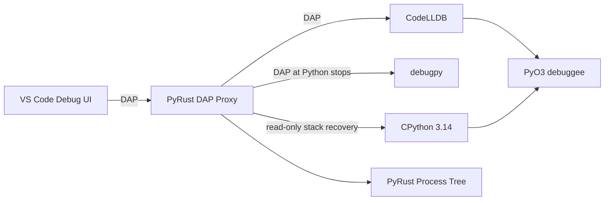

# PyRust Debugger

**A Developer Tools prototype for mixed CPython 3.14 and Rust debugging in VS
Code.**

Licensed under [Apache-2.0](LICENSE).

PyRust combines CodeLLDB's native stack with read-only CPython frame recovery,
then presents the result through one DAP session. It also adds a Process Tree
that groups real processes and native threads without inventing false nesting
for `asyncio` tasks, Rust futures, or independent OS threads.

```text
Python -> Rust extension -> Rust breakpoint
Rust -> embedded Python -> Rust callback
Python thread -> Rust -> named Rust child thread
```

Start with the [Developer Tools submission narrative](docs/submission/openai-build-week.md),
[demo runbook](docs/submission/demo-runbook.md), and
[submission checklist](docs/submission/checklist.md).

## Built With Codex and GPT-5.6

It is just like a chat partner and ask for explicit permissions whenever needed.
Sometimes it misinterpret but we are like code-surfing. It comes at speed and you
need to drive carefully.

You can insert objection and it can follow up with mutiline of thinking.

But for hard problems it needs some iterations.

## Quick Demo Gate

In the Dev Container, run:

```bash
./scripts/verify-submission.sh
```

Then choose **PyRust: Python and Rust Threads**, set a breakpoint at
`research/fixtures/python_outer/src/lib.rs:6`, and start debugging. See the
[demo runbook](docs/submission/demo-runbook.md) for the exact recording flow.

## Architecture At A Glance



CodeLLDB owns Rust stops, native frames, and Rust evaluation. With
`pyrustPythonDebug: true`, debugpy owns Python source-breakpoint stops and
provides normal Python variables and evaluation. PyRust coordinates those
owners per process and keeps the read-only CPython snapshot path for Python
frames observed at a Rust stop.

## Why PyRust

- **One debugging session:** instead of asking developers to correlate a
  Python debugger and a native debugger manually.
- **Correct concurrency model:** actual processes own native threads; unrelated
  threads and async tasks are not rendered as fake nested call stacks.
- **Native debugger preserved:** Rust expressions, scopes, source breakpoints,
  and stepping behavior stay under CodeLLDB ownership.
- **Full Python stops, safe native stops:** opt-in debugpy supports normal
  Python breakpoints and evaluation; Python frames reached from a Rust stop use
  a bounded read-only snapshot instead.

## Initial direction

The first target is:

```text
Python application -> Rust extension
```

This is the cheaper direction to validate because LLDB can launch the Python
executable and debug the Rust shared library normally. The project only needs
to add Python's logical frames to the native stack.

The implemented reverse proof:

```text
Rust application -> embedded Python -> Rust callback
```

uses the same stack-merging mechanism. ADR 0003 bounds permanently hung
in-process unwinds with a session circuit breaker and proves this reverse stack
at an explicit Rust callback breakpoint. ADR 0009 adds opt-in debugpy Python
breakpoints and full Python evaluation for this direction.

## MVP boundary

The first milestone remains native-debugger-first:

- launch Python under CodeLLDB;
- stop at a Rust breakpoint;
- show active Python frames and native Rust frames in one VS Code call stack;
- support CPython 3.14 on Linux first.

Python breakpoints are available in opt-in debugpy launch configurations.
Cross-language stepping remains a later milestone. ADR 0005 provides bounded
read-only snapshots for Python frames at native stops, while ADR 0009 adds
full debugpy evaluation at Python-owned stops. See
[the documentation index](docs/README.md).

## Full Python Debugging

Run the hybrid acceptance suite:

```bash
./scripts/accept-debugpy-slice.sh
```

Then select **PyRust: Python Outer (debugpy)**, set a breakpoint at
`research/fixtures/python_outer/app.py:10`, and start debugging. At that
Python stop, expressions such as `type(2).__name__` and
`__import__('sys').version_info[:2]` work normally. Continue to the Rust
breakpoint to return to the merged Python/Rust stack.

## Debugger Ownership Limitation

PyRust presents Python and Rust frames in one VS Code session, but a stopped
process still has one active debugger owner:

- At a Python-owned stop, debugpy provides normal Python evaluation, imports,
  function calls, object expansion, and Python stepping.
- At a Rust-owned stop, CodeLLDB provides normal Rust evaluation and native
  debugging. Selecting a recovered Python frame in a `(debugpy)` launch
  transfers that exact PID/TID to a real debugpy stop for live Python scopes,
  imports, calls, object expansion, evaluation, and assignment.

At that transferred stop, `stepIn` returns to the current CodeLLDB Rust frame.
`next` and `stepOut` use a temporary real debugpy breakpoint to stop at the
next source statement in the selected frame or its immediate Python caller.
They require an unambiguous, source-backed destination; otherwise PyRust
reports an explicit error instead of exposing its injected helper frame. With
`pyrustPythonDebug: false`, the legacy snapshot path remains limited to
primitive locals and the safe expression subset.

Selecting a live Rust lease frame at a Python-owned stop routes `next`,
`stepIn`, and `stepOut` through CodeLLDB. PyRust first returns to the selected
instruction on its resolved OS thread, then exposes CodeLLDB's actual native
step result. Threads created after debugpy startup resolve their native TID
from the selected live Python frame instead of falling back to the process
leader.

This remains an execution-ownership boundary, not simultaneous control by both
debuggers. PyRust performs an explicit ownership transfer before querying the
foreign-language engine.

The two executable research fixtures and observed CodeLLDB results are
documented in [the fixture report](docs/research/fixture-results.md).

## Early probe

CPython 3.14 exports debugger metadata and includes a remote unwinder that can
read Python stacks directly from another process. `prototype/python` wraps that
facility and proves it can read a debuggee both while running and while stopped.
The target process needs no tracing hooks or injected recorder.

## Development environment

The repository uses CPython 3.14.6. Create the local environment with:

```bash
uv python install 3.14
uv venv --python 3.14 .venv
```

The environment has already been created in this workspace. Verify it with:

```bash
.venv/bin/python --version
```

Run the prototype tests with:

```bash
PYTHONPATH=prototype/python \
  .venv/bin/python -m unittest discover -s prototype/python/tests -v
```

## First workable slice

The fixture-bound DAP proof is implemented under `prototype/adapter`. Run its
complete automated contract, including the real CodeLLDB integration, with:

```bash
./scripts/accept-first-slice.sh
```

The command must report `PASS` for `AC-HP-01` through `AC-SP-04`. This slice is
limited to the documented CPython 3.14, Linux, single-thread Python-to-Rust
fixture.

Run the stabilization and Rust-outer callback proof with:

```bash
./scripts/accept-reverse-slice.sh
```

This command reports `PASS` for `AC-BF-01` through `AC-BF-05` and `AC-RP-01`
through `AC-RP-07`, while also rerunning the original slice.

## Containerized VS Code validation

ADR 0004 adds a local `pyrust` VS Code extension and a pinned Linux x86_64 Dev
Container. Run its complete automated contract with:

```bash
./scripts/accept-container.sh
```

The command builds from a no-cache state, recreates the container and its named
volumes, runs both debugger directions, and starts VS Code 1.125.0 under
`xvfb`. It must report `AC-CV-01 PASS` through `AC-CV-10 PASS`.

The extension is local and fixture-bound; it is not published to the
Marketplace. Human Call Stack validation remains a separate checklist in
[`docs/acceptance/containerized-vscode-manual.md`](docs/acceptance/containerized-vscode-manual.md).
When Docker and the checkout are on a remote Linux machine, connect to that
machine with VS Code Remote-SSH, open the remote checkout, and then use
`Dev Containers: Reopen in Container`; the checklist includes the full remote
unblocking sequence.
